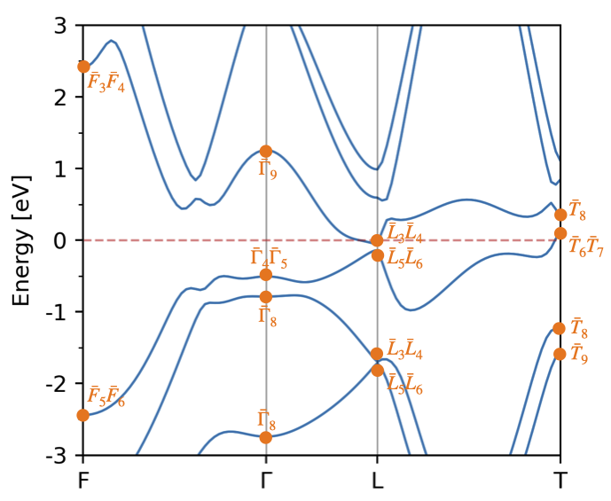
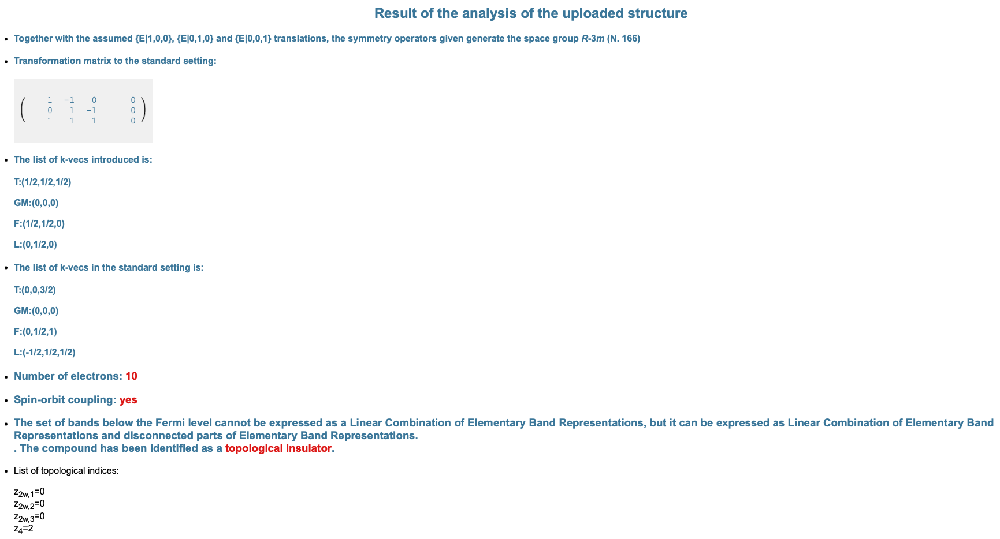

# Bi: diagnosing higher-order topology

In this tutorial, we will use IrRep to classify the topology of Bi. We will use as input DFT data obtained with the Vienna *ab initio* simulation package. This data consists of the POSCAR and WAVECAR files in the current directory. The input files for VASP necessary to obtain this data ca be found in the directory `inputs`.

**Exercises:**

- [Exercise 1: Identify the space group](#identification-of-the-space-group)
- [Exercise 2: Calculate the irreducible representations at maximal k-points](#irreducible-representations-at-maximal-k-points)
- [Exercise 3: Diagnose the topology of valence bands](#diagnosing-topology-of-valence-bands)
- [Exercise 4: Separate wave functions by inversion eigenvalues](#separating-states-by-inversion-eigenvalues)

## Identification of the space group

Bismuth crystallizes in a rhombohedral structure. However, there exist many rhombohedral space groups. To find the space group of our material, we need the cell vectors that describe the periodicity of the lattice, and the positions of atoms within the unit cell. This is contained in the POSCAR file. We can open the POSCAR and try to identify the space group, but usually this is not a straightforward task. Instead, we can use IrRep to do it automatically:

```
irrep -onlysym > out
```

With `> out`, we have saved the output of IrRep into a file called `out`. If we open this file with a text editor, we will find:

- A description of the crystal structure parsed from DFT files (the POSCAR, in this case). We see that the cell used for the DFT calculation was a primitive cell which contains two Bi atoms.

- The name of the space group. It is the rhombohedral group R-3m (No. 166). It contains 12 symmetry operations (mod. translations).

- A list of symmetry operations. Each symmetry operation is described by giving the matrix of its rotational part, the vector of the translational part, its action on a generic **k**-point, its rotation axis, angle and whether it respects chirality or not (`inversion` tag).


## Irreducible representations at maximal k-points

IrRep is able calculate the traces of symmetry operations in every **k**-point. Furthermore, if the **k**-point is maximal, IrRep can identify the irreducible representation of every wave function by comparing the traces to the character tables of irreducible representations. For that, we have to run IrRep with the `-kpnames` option:

```
irrep -code=vasp -kpnames=T,GM,F,L -Ecut=50 -IBend=12 -searchcell -spinor -EF=5.2244 > out
```

Let us comment on each argument passed to the command above:

- `code` specifies the interface that should be applied. In this case, it is the interface for VASP (default).

- `kpnames` passes the labels of **k**-points. They should follow the same order as in the file of wave functions (the WAVECAR in this case).

- `Ecut` sets the plane-wave cutoff that will be used for the calculation. Coefficients of plane waves with larger energy will be discarded. Setting it to a value smaller than the cutoff considered in the DFT calculation reduces considerably the time of the calculation.

- `IBend` is the index of the last band considered for the calculation. The convergence of the last bands tends to be poor in DFT, hence it might be convenient to discard them.

- `spinor` indicates that the DFT calculation included SOC.

- `EF` is the Fermi energy. All energy levels will be given with respect to this value. If it is set to `-EF=auto`, IrRep will try to parse it from DFT data and it will set it to 0.0 if it could not find it (the case of VASP).

- `searchcell` is an important parameter. It is used to ask IrRep to determine automatically the transformation from the DFT cell to the conventional cell of the tables. The transformation can alternatively be specified via `-refUC` and `-shiftUC`.

Let us open the file `out` generated by this command and go through the output.

- First, we see the same description of the unit cell and space group that we studied above. However, we can find something that is different: 

    ```
            |   1.0000 -1.0000 -0.0000 |
    refUC = |   0.0000  1.0000 -1.0000 |    shiftUC = [-0. -0. -0.]
            |   1.0000  1.0000  1.0000 |
    ```

    It tells us that the transformation from the DFT cell to the conventional setting. See [IrRep's documentation](https://irrep.dipc.org/cell_transformation.html) for more details.

- Then, we have a block for each maximal **k**-point passed to the code. The header of each block contains the coordinates of the **k**-point in both, the DFT and conventional cell. The number of symmetries in the little group is also written (mod. translations).

    ```
    k-point   1 : [0.5 0.5 0.5] (in DFT cell)
                  [0.  0.  1.5] (after cell trasformation)

    number of states : 12
    ```

    After the header, we can find a list of **energy levels** and **irreducible representations** of identified for each one. The **traces** of symmetries in the little-group are also listed in the same row. The next row contains the traces in the conventional cell.

    ```
       Energy  |   degeneracy  |       irreps       | sym. operations                     
               |               |                    |    1        2        3        4     
     -11.6046  |        2      | -T9(1.0)           |   2.0000   1.0000   1.0000  -0.0000    
               |               |                    |   2.0000   1.0000   1.0000   0.0000 
     -10.0391  |        2      | -T8(1.0)           |   2.0000   1.0000   1.0000   0.0000 
               |               |                    |   2.0000   1.0000   1.0000  -0.0000 
      -1.5692  |        2      | -T9(1.0)           |   2.0000   1.0000   1.0000  -0.0000 
               |               |                    |   2.0000   1.0000   1.0000   0.0000 
      -1.2288  |        2      | -T8(1.0)           |   2.0000   1.0000   1.0000   0.0000 
               |               |                    |   2.0000   1.0000   1.0000  -0.0000 
       0.1380  |        2      | -T6(1.0), -T7(1.0) |   2.0000  -2.0000  -2.0000   0.0000 
               |               |                    |   2.0000  -2.0000  -2.0000  -0.0000 
       0.2922  |        2      | -T8(1.0)           |   2.0000   1.0000   1.0000   0.0000 
               |               |                    |   2.0000   1.0000   1.0000  -0.0000 
    ```

- Finally, the gap with respect to the next set of bands (with index `IBend`+1) is given. Also the number of inversion odd Krammers pairs, if the little group contains inversion.

    ```
    Invariant under inversion: Yes
    Number of inversions-odd Kramers pairs : 3
    Gap with upper bands:  0.5552250943410071
    ```

Once we know the irreps, we can place them on top of a band structure plot, which should be calculated via DFT.

<p align='center'>

</p>


## Diagnosing topology of valence bands

In the previous section, we have determined the irreducible representations of valence and some conduction bands. In order to classify the topology of a material, **we need to focus on its valence bands**. We can do so by **setting** `-IBend` **to the index of the last valence band**, which is 10 in the case of Bi:

```
irrep -code=vasp -kpnames=T,GM,F,L -Ecut=50 -IBend=10 -searchcell -spinor -EF=5.2244 > out
```

If we inspect the output saved into the file `out`, we will notice that only the lowest 10 bands (*i.e.* the valence bands) where considered for the calculation. According to the formalism of [topological quantum chemistry](https://www.nature.com/articles/nature23268), to show that the material is topological, it is enough demonstrate that the irreducible representations do not match with those of a linear combination of elementary band representation. We can check this by means of the file `trace.txt` written by IrRep.

1- Open the webpage of the application [ChecktopologicalMat](https://www.cryst.ehu.es/cgi-bin/cryst/programs/magnetictopo.pl?tipog=gesp)  in the Bilbao Crystallographic Server.

2- Upload the file named `trace.txt` generated by IrRep. This software will use the output of IrRep to determine if the representation of the bands passed to it matches a band representation, and it will calculate the values of space group's [symmetry-indicators of topology](https://www.nature.com/articles/s41467-017-00133-2).

You should see something like the following picture:

<p align='center'>

</p>

According to this analysis, Bi hosts a topological phase classified by a z<sub>2</sub>, due to a double band inversion invisible to the z<sub>2</sub> indicator. This [number indicates](https://www.nature.com/articles/s41467-018-06010-w) that **Bi is a higher-order topological insulator**. Indeed, [F. Schindler *et al.*](https://www.nature.com/articles/s41567-018-0224-7) demonstrated that Bi exhibits with gapless hinge modes.


## Separating states by inversion eigenvalues

Identifying irreducible representations is not IrRep's only function. It is also able to separate wave functions based on eigenvalue of a symmetry operation. Let us take advantage of this function to corroborate the calculation of strong z<sub>2</sub> invariant and the z<sub>4</sub>. For that, we have to separate wave functions in subspaces of inversion.

1- First, we have to identify the number of inversion. Open the output generated by IrRep in any of the previous steps and identify the number that labels inversion:

```
 ### 7 

    rotation : | -1   0   0 |     rotation : | -1   0   0 |
               |  0  -1   0 |      (refUC)   |  0  -1   0 |
               |  0   0  -1 |                |  0   0  -1 |
```

Thus, **inversion is the symmetry number 7**.

2- Indicate IrRep that we want to separate the wave functions in terms of inversion, by setting `-isymsep=7`:

```
irrep -isymsep=7 -code=vasp -kpnames=T,GM,F,L -Ecut=50 -IBend=10 -searchcell -spinor -EF=5.2244 > out
```

    IrRep will write first the traces and irreducible representations without separating them. Then, it will focus on each subspace of inversion and write the traces and irreps within each. 

3- We are interested in the inversion-odd subspace. We can find the data about odd wave functions after the heading

```
 ################################################ 


 NEXT SUBSPACE:   sym # 7 -> eigenvalue -1.000
```

After the heading, we will listed every wave function and its irrep. To corroborate the z<sub>2</sub> and z<sub>4</sub> numbers, we count the number of odd valence states at every inversion-invariant **k**-point:

<div align="center">

   |                 |  T  |  &Gamma;  |  F  |  L  |
   | :-------------: |  -- | --------- | --- | --- | 
   | *N*<sub>-</sub> |  6  |     2     |  6  |  6  | 

</div>

Since there are 3 partners for the points F and L, the number of inversion-odd wave functions is:

<div align="center">
N<sub>4</sub> = 6 + 2 + 6 x 3 + 6 x 3 = 44.
</div>

According to [Fu-Kane's formula](https://journals.aps.org/prb/abstract/10.1103/PhysRevB.76.045302), the strong invariant is z<sub>2</sub>:

<div align="center">
z<sub>2</sub> = N<sub>-</sub>/2 mod 2 = 0.
</div>

On the other hand, the z<sub>4</sub> number is:

<div align="center">
z<sub>4</sub> = N<sub>-</sub>/2 mod 4 = 2.
</div>


