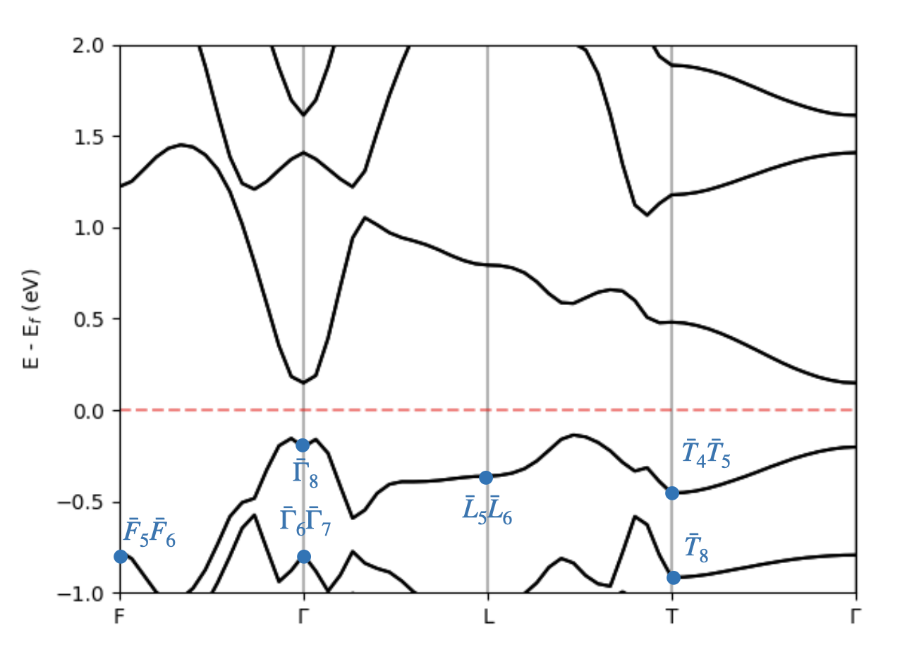
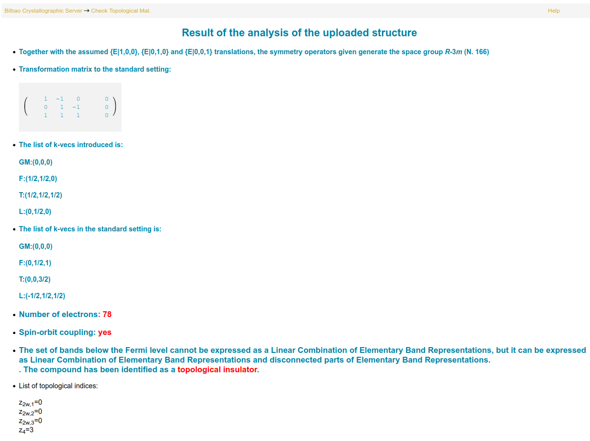

# Bi<sub>2</sub>Se<sub>3</sub>: diagnosing topology

In this tutorial, we will use IrRep to classify the topology of Bi<sub>2</sub>Se<sub>3</sub>. We will use as input DFT data obtained with the [Quantum Espresso](https://www.quantum-espresso.org). The data is in the out directory. The input files for Quantum Espresso necessary to obtain this data ca be found in the directory `inputs`.

**Exercises:**

- [Exercise 1: Identify the space group](#identification-of-the-space-group)
- [Exercise 2: Diagnose the topology of valence bands](#diagnosing-topology-of-valence-bands)
- [Exercise 3: Separate wave functions by inversion eigenvalues](#separating-states-by-inversion-eigenvalues)

## Identification of the space group

If we look into the input files for Quantum Espresso, we notice that the lattice vectors specified for Bi<sub>2</sub>Se<sub>3</sub> belong to a rhombohedral family. However, it is not easy to guess the space group by inspecting the atomic positions. We can use IrRep for this task:

```
irrep -code=espresso -prefix=out/Bi2Se3 -onlysym > output
```

The `prefix` option should be indicate the path to the `.save` directory generated by Quantum Espresso, thus it is related to the Quantum Espresso's arguments `outdir` and `prefix`.  With `> out`, we have saved the output of IrRep into a file called `out`. If we open this file with a text editor, we will find:

- A description of the crystal structure parsed from DFT files. We see that the cell used for the DFT calculation was a primitive cell.

```
 ---------- CRYSTAL STRUCTURE ---------- 


Cell vectors in angstroms:

      Vectors of DFT cell       |      Vectors of REF. cell      
a0 =  2.0715   1.1960   9.5453  |  a0 =  2.0715  -2.0715   0.0000
a1 = -2.0715   1.1960   9.5453  |  a1 =  1.1960   1.1960  -2.3920
a2 =  0.0000  -2.3920   9.5453  |  a2 =  9.5453   9.5453   9.5453

Atomic positions in direct coordinates:

Atom type |   Position in DFT cell    |   Position in REF cell   
    1     |  0.6015   0.6015   0.6015 |  0.6015   0.6015   0.6015
    1     |  0.3985   0.3985   0.3985 |  0.3985   0.3985   0.3985
    2     |  0.0000   0.0000   0.0000 |  0.0000   0.0000   0.0000
    2     |  0.7885   0.7885   0.7885 |  0.7885   0.7885   0.7885
    2     |  0.2115   0.2115   0.2115 |  0.2115   0.2115   0.2115
```

- The name of the space group. It is the rhombohedral group R-3m (No. 166). It contains 12 symmetry operations (mod. translations).

```
Space group: R-3m (# 166)
Number of symmetries: 12 (mod. lattice translations)
```

- A list of symmetry operations. Each symmetry operation is described by giving the matrix of its rotational part, the vector of the translational part, its action on a generic **k**-point, its rotation axis, angle and whether it respects chirality or not (`inversion` tag).

```
 ### 3 

rotation : |  0   0   1 |
           |  1   0   0 |
           |  0   1   0 |


 gk = [kz, kx, ky]

spinor rot.         : | 0.500-0.866j -0.000-0.000j |
                      | 0.000-0.000j  0.500+0.866j |

translation         :  [   0.0000   0.0000   0.0000 ] 

axis: [0. 0. 1.] ; angle = 2/3 pi, inversion : False
```

## Diagnosing topology of valence bands

Let us calculate the irreducible representations at maximal **k**-points for the occupied bands. For that, we need to:

- Pass the labels of the maximal **k**-points via the argument `-kpnames`. The labels should be in the same order as the k-points in the `K_POINTS` block in Quantum Espresso input (file `nscf_IrRep.in` in this tutorial).

- We need to set `-IBend` to the index of the last band we want to consider. Since the number of electrons is 78 (see output of the self-consistent Quantum Espresso calculation), the occupied band has index 78, thus we need `-IBend=78`.

```
irrep -kpnames=GM,F,T,L -IBend=78 -Ecut=100 -EF=auto -code=espresso -prefix=out/Bi2Se3 > output
```

Let us comment on the rest of arguments passed to the command above:

- `code` specifies the interface that should be applied. In this case, it is the interface for Quantum Espresso.

- `Ecut` sets the plane-wave cutoff that will be used for the calculation. Coefficients of plane waves with larger energy will be discarded. Setting it to a value smaller than the cutoff considered in the DFT calculation reduces considerably the time of the calculation.

- `EF` is the Fermi energy. All energy levels will be given with respect to this value. Here, we are asking IrRep to parse it from the DFT output.

Let us open the file `out` generated by this command and go through the output.

- First, we see the same description of the unit cell and space group that we studied above. However, we can find something that is different: 

    ```
            |   1.0000 -1.0000  0.0000 |
    refUC = |  -0.0000  1.0000 -1.0000 |    shiftUC = [-0.  0.  0.]
            |   1.0000  1.0000  1.0000 |
    ```

    It tells us that the transformation from the DFT cell to the conventional setting. See [IrRep's documentation](https://irrep.dipc.org/cell_transformation.html) for more details.

- Then, we have a block for each maximal **k**-point passed to the code. The header of each block contains the coordinates of the **k**-point in both, the DFT and conventional cell. The number of symmetries in the little group is also written (mod. translations).

    ```
    k-point   2 : [ 0.5  0.5 -0. ] (in DFT cell)
                  [0.  0.5 1. ] (after cell trasformation)

    number of states : 80
    ```

    After the header, we can find a list of **energy levels** and **irreducible representations** of identified for each one. The **traces** of symmetries in the little-group are also listed in the same row. The next row contains the traces in the conventional cell.

    ```
       Energy  |   degeneracy  |       irreps       | sym. operations  
               |               |                    |    1        5        7       11    
     -49.4201  |        2      | -F3(1.0), -F4(1.0) |   2.0000   0.0000   2.0000   0.0000
               |               |                    |   2.0000   0.0000   2.0000   0.0000
     -49.1098  |        2      | -F3(1.0), -F4(1.0) |   2.0000  -0.0000   2.0000  -0.0000
               |               |                    |   2.0000  -0.0000   2.0000  -0.0000
     -48.6115  |        2      | -F5(1.0), -F6(1.0) |   2.0000  -0.0000  -2.0000   0.0000
               |               |                    |   2.0000  -0.0000  -2.0000   0.0000
     -47.6185  |        2      | -F3(1.0), -F4(1.0) |   2.0000   0.0000   2.0000   0.0000
    ```
    
    In this case, the form pairs due to the presence of time-reversal symmetry in the symmetry group.

- Finally, the gap with respect to the next set of bands (with index `IBend`+1) is given. Also the number of inversion odd Krammers pairs, if the little group contains inversion.

    ```
    Invariant under inversion: Yes
    Number of inversions-odd Kramers pairs : 18
    Gap with upper bands:  1.193565132807561
    ```

Once we know the irreps, we can place them on top of a band structure plot, which should be calculated via DFT.

<p align='center'>

</p>


If we inspect the output saved into the file `output`, we will notice that only the lowest 78 bands (*i.e.* the valence bands) where considered for the calculation. According to the formalism of [topological quantum chemistry](https://www.nature.com/articles/nature23268), to show that the material is topological, it is enough demonstrate that the irreducible representations do not match with those of a linear combination of elementary band representation. We can check this by means of the file `trace.txt` written by IrRep.

1- Open the webpage of the application [ChecktopologicalMat](https://www.cryst.ehu.es/cgi-bin/cryst/programs/magnetictopo.pl?tipog=gesp)  in the Bilbao Crystallographic Server.

2- Upload the file named `trace.txt` generated by IrRep. This software will use the output of IrRep to determine if the representation of the bands passed to it matches a band representation, and it will calculate the values of space group's [symmetry-indicators of topology](https://www.nature.com/articles/s41467-017-00133-2).

You should see something like the following picture:

<p align='center'>

</p>

According to this analysis, Bi hosts a topological phase classified the following symmetry-indicators:

<div align="center">

(*z*<sub>2w,1</sub>, *z*<sub>2w,2</sub>, *z*<sub>2w,3</sub>, *z*<sub>4</sub>) = (0, 0, 0, 3).

</div>

This [numbers indicate](https://www.nature.com/articles/s41467-018-06010-w) that Bi<sub>2</sub>Se<sub>3</sub> **is a strong-topological insulator protected by time-reversal symmetry**. 


## Separating states by inversion eigenvalues

Identifying irreducible representations is not IrRep's only function. It is also able to separate wave functions based on eigenvalue of a symmetry operation. Let us take advantage of this function to corroborate the calculation of z<sub>2</sub> invariant and z<sub>4</sub> invariants. For that, we have to separate wave functions in subspaces of inversion.

1- First, we have to identify the number of inversion. Open the output generated by IrRep in any of the previous steps and identify the number that labels inversion:

```
     ### 7 
    
    rotation : | -1   0   0 |     rotation : | -1   0   0 |
               |  0  -1   0 |      (refUC)   |  0  -1   0 |
               |  0   0  -1 |                |  0   0  -1 |
```

Thus, **inversion is the symmetry number 7**.

2- Indicate IrRep that we want to separate the wave functions in terms of inversion, by setting `-isymsep=7`:

```
irrep -isymsep=7 -kpnames=GM,F,T,L -IBend=78 -Ecut=100 -EF=auto -code=espresso -prefix=out/Bi2Se3 > output
```

IrRep will write first the traces and irreducible representations without separating them. Then, it will focus on each subspace of inversion and write the traces and irreps within each. 

3- We are interested in the inversion-odd subspace. We can find the data about odd wave functions after the heading

```
 ################################################ 


 NEXT SUBSPACE:   sym # 7 -> eigenvalue -1.000
```

After the heading, we will listed every wave function and its irrep. To corroborate the z<sub>2</sub> and z<sub>4</sub> numbers, we count the number of odd valence states at every inversion-invariant **k**-point:

<div align="center">

   |                 |   &Gamma;  |  F  |  T  |  L  |
   | :-------------: |  --------- | --- | --- | --- | 
   | *N*<sub>-</sub> |      36    |  38 |  38 |  38 | 

</div>

Since there are 3 partners for the points F and L, the number of inversion-odd wave functions is:

<div align="center">
N<sub>4</sub> = 34 + 38 x 3 + 38 + 38 x 3 = 300.
</div>

According to [Fu-Kane's formula](https://journals.aps.org/prb/abstract/10.1103/PhysRevB.76.045302), the strong invariant is z<sub>2</sub>:

<div align="center">
z<sub>2</sub> = N<sub>-</sub> mod 2 = 0.
</div>

On the other hand, the z<sub>4</sub> number is:

<div align="center">
z<sub>4</sub> = N<sub>-</sub> mod 4 = 3.
</div>

