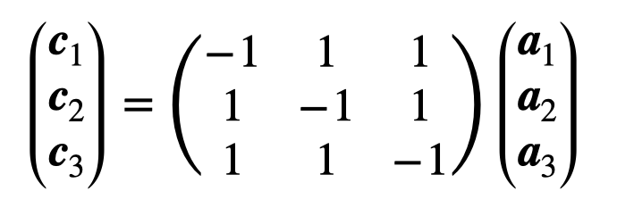
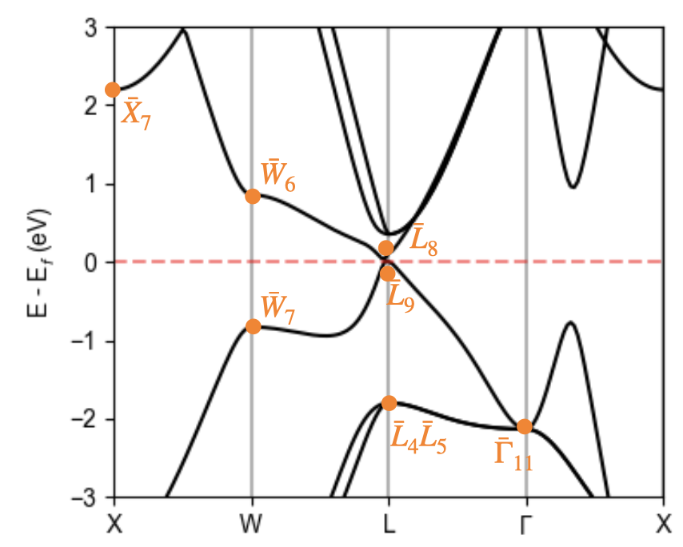

# SnTe: diagnosing crystalline topology and explaining the cell transformation

In this tutorial, we will use IrRep to classify the topology of SnTe, but **we will force ourselves to use the argument** `-refUC`. This way, we will learn how to deal with the difference between DFT and conventional settings. We will use as input DFT data obtained with the [Abinit](https://www.abinit.org). This data consists of the file maxK_WFK located in the current directory. The input files for Abinit necessary to obtain this data ca be found in the directory `inputs`.

**Exercises**:

- [Exercise 1: Identify the space group](#identification-of-the-space-group)
- [Exercise 2: Identify the transformation to the conventional cell ](#transformation-to-the-conventional-cell)
- [Exercise 3: Calculate the irreducible representations at maximal k-points](#irreducible-representations-at-maximal-k-points)
- [Exercise 4: Determine the topology of valence bands](#diagnosing-topology-of-valence-bands)
- [Exercise 5: Separate the states by inversion eigenvalues](#separating-states-by-inversion-eigenvalues)


## Identification of the space group

SnTe crystallizes in a face-centered cubic structure. There exist 11 different face-centered cubic space groups. To determine the precise space group of our material, we need the cell vectors that describe the periodicity of the lattice, and the positions of atoms within the unit cell. This information is in the maxK_WFK file, but we can not open and read it, as this is a binary file. Instead, we can use IrRep to extract this information:

```
irrep -onlysym -code=abinit -fWFK=maxK_WFK > out
```

With the specifications `-code=abinit` and `-fWFK=maxK_WFK`, we are telling IrRep to use the interface for Abinit and to parse the DFT data from the file maxK_WFK. With `> out`, we have saved the output of IrRep into a file called `out`. If we open this file with a text editor, we will find:

- A description of the crystal structure parsed from DFT files. We see that the cell used for the DFT calculation was a primitive cell which contains one Sn atom at the origin and another Te atom in the center of the cell.

- The name of the space group. It is the rhombohedral group Fm-3m (No. 225). It contains 48 symmetry operations (mod. translations).

- A list of symmetry operations. Each symmetry operation is described by giving the matrix of its rotational part, the vector of the translational part, its action on a generic **k**-point, its rotation axis, angle and whether it respects chirality or not (`inversion` tag).


## Transformation to the conventional cell

IrRep is able calculate the traces of symmetry operations in every **k**-point, also to identify the irreducible representatins (irreps). For that, it needs the transformation from the DFT cell to the conventional setting in which the tables of irreps are written. As long as we set a valid `-kpnames`, IrRep will work out the transformation automatically. But, we enjoy challenges, so **let us assume that we want to use -refUC**.

In our DFT calculation, we used a primitive unit cell. This is often the case, as primitive cells include less atoms than centered cells, and therefore reduce the time and computational resources needed to run the calculation. On the other hand, the table of irreps is written with a conventional cell choice, which is a face-centered cell in this case. The transformation from the DFT cell's vectors (**a**<sub>1</sub>, **a**<sub>2</sub>, **a**<sub>3</sub>)  into the face-center cube's vectors (**c**<sub>1</sub>, **c**<sub>2</sub>, **c**<sub>3</sub>) is given by:

<p align='center'>

</p>

We have to set `-refUC` as to pass to irrep this transformation matrix, so we will be running IrRep with 

```
-refUC=-1,1,1,1,-1,1,1,1,-1
```

For a more detailed explanation of the cell transformation, visit [IrRep's documentation](https://irrep.dipc.org/cell_transformation.html).

## Irreducible representations at maximal k-points

Now, we can calculate the irreps. There are 20 electrons in the unit cell, so there are 20 occupied bands. Let us set `-IBend=22` to calculate the irreps of all valence and the first 2 conduction bands:

```
irrep -kpnames=GM,X,L,W -IBend=22 -Ecut=100 -refUC=-1,1,1,1,-1,1,1,1,-1 -EF=auto  -code=abinit -fWFK=maxK_WFK  > out
```

Let us open the file `out` generated by this command and go through the output.

- After a description of the crystal structure and space group, we have a block for each maximal **k**-point passed to the code. The header of each block contains the coordinates of the **k**-point in both, the DFT and conventional cell. The number of symmetries in the little group is also written (mod. translations).

    ```
    k-point   2 : [0.5 0.  0.5] (in DFT cell)
                  [0. 1. 0.] (after cell trasformation)

    number of states : 22
    ```

    After the header, we can find a list of **energy levels** and **irreducible representations** of identified for each one. The **traces** of symmetries in the little-group are also listed in the same row. The next row contains the traces in the conventional cell.

    ```
      Energy  |   degeneracy  |  irreps  | sym. operations                     
              |               |          |    1        2        3        4       21    
     -7.2711  |        2      | -X6(1.0) |   2.0000   0.0000   0.0000   0.0000   1.4142
              |               |          |   2.0000   0.0000   0.0000   0.0000   1.4142
     -6.3611  |        2      | -X8(1.0) |   2.0000  -0.0000   0.0000  -0.0000   1.4142
              |               |          |   2.0000  -0.0000   0.0000  -0.0000   1.4142
     -4.7342  |        2      | -X8(1.0) |   2.0000   0.0000   0.0000  -0.0000   1.4142
              |               |          |   2.0000   0.0000   0.0000  -0.0000   1.4142
     -4.2995  |        2      | -X9(1.0) |   2.0000  -0.0000   0.0000   0.0000  -1.4142
              |               |          |   2.0000  -0.0000   0.0000   0.0000  -1.4142
      1.4154  |        2      | -X7(1.0) |   2.0000  -0.0000  -0.0000  -0.0000  -1.4142
              |               |          |   2.0000  -0.0000  -0.0000  -0.0000  -1.4142
    ```

- Finally, the gap with respect to the next set of bands (with index `IBend`+1) is given. Also the number of inversion odd Krammers pairs, if the little group contains inversion.

    ```
    Invariant under inversion: Yes
    Number of inversions-odd Kramers pairs : 3
    Gap with upper bands:  2.3747815703844037
    ```

Once we know the irreps, we can place them on top of a band structure plot, which should be calculated via DFT.

<p align='center'>

</p>


## Diagnosing topology of valence bands

In the previous section, we have determined the irreducible representations of valence and some conduction bands. In order to classify the topology of a material, **we need to focus on its valence bands**. We can do so by **setting** `-IBend` **to the index of the last valence band**, which is 20 in the case of SnTe:

```
irrep -kpnames=GM,X,L,W -IBend=20 -Ecut=100 -refUC=-1,1,1,1,-1,1,1,1,-1 -EF=auto  -code=abinit -fWFK=maxK_WFK  > out
```

If we inspect the output saved into the file `out`, we will notice that only the lowest 10 bands (*i.e.* the valence bands) where considered for the calculation. According to the formalism of [topological quantum chemistry](https://www.nature.com/articles/nature23268), to show that the material is topological, it is enough demonstrate that the irreducible representations do not match with those of a linear combination of elementary band representation. We can check this by means of the file `trace.txt` written by IrRep.

1- Open the webpage of the application [ChecktopologicalMat](https://www.cryst.ehu.es/cgi-bin/cryst/programs/magnetictopo.pl?tipog=gesp)  in the Bilbao Crystallographic Server.

2- Upload the file named `trace.txt` generated by IrRep. This software will use the output of IrRep to determine if the representation of the bands passed to it matches a band representation, and it will calculate the values of space group's [symmetry-indicators of topology](https://www.nature.com/articles/s41467-017-00133-2).

You should see something like the following picture:

<p align='center'>

</p>

According to this analysis, SnTe is a topological insulator classified by a z<sub>8</sub>=4, which indicates that the phase hosts mirror Chern invariants, as well as glide invariants ([see the work by Song *et al.*](https://www.nature.com/articles/s41467-018-06010-w).


## Separating states by inversion eigenvalues

Identifying irreducible representations is not IrRep's only function. It is also able to separate wave functions based on eigenvalues of a symmetry operations. Let us take advantage of this function to corroborate the calculation of strong z<sub>2</sub> invariant and the z<sub>4</sub>. For that, we have to separate wave functions in subspaces of inversion.

1- First, we have to identify the number of inversion. Open the output generated by IrRep in any of the previous steps and identify the number that labels inversion:

```
     ### 25 
    
    rotation : | -1   0   0 |     rotation : | -1   0   0 |
               |  0  -1   0 |      (refUC)   |  0  -1   0 |
               |  0   0  -1 |                |  0   0  -1 |
```

Thus, **inversion is the symmetry number 25**.

2- Indicate IrRep that we want to separate the wave functions in terms of inversion, by setting `-isymsep=25`:

```
irrep -isymsep=25 -kpnames=GM,X,L,W -IBend=20 -Ecut=100 -refUC=-1,1,1,1,-1,1,1,1,-1 -EF=auto  -code=abinit -fWFK=maxK_WFK  > out
```

Ups, it seems something went wrong... The problem is in the list of points. We are asking IrRep to separate wave functions based on their eigenvalue of inversion at W. But this point is not invariant under inversion! So, what we are trying to do does not make sense. 

We need to get rig of the point W. For that, we have to specified only the inversion invariant  **k**-points via the argument `-kpoints`:

```
irrep -isymsep=25 -kpnames=GM,X,L -kpoints=1,2,3 -IBend=20 -Ecut=100 -refUC=-1,1,1,1,-1,1,1,1,-1 -EF=auto  -code=abinit -fWFK=maxK_WFK  > out
```

IrRep will write first the traces and irreducible representations without separating them. Then, it will focus on each subspace of inversion and write the traces and irreps within each. 

3- We are interested in the inversion-odd subspace. We can find the data about odd wave functions after the heading

```
 ################################################ 


 NEXT SUBSPACE:   sym # 25 -> eigenvalue -1.000
```

After the heading, we will listed every wave function and its irrep. To corroborate the z<sub>2</sub> and z<sub>4</sub> numbers, we count the number of odd valence states at every inversion-invariant **k**-point:

<div align="center">

   |                 |   &Gamma;  |  X  |  L  |
   | :-------------: |  --------- | --- | --- | 
   | *N*<sub>-</sub> |      6     |  6  |  4  | 

</div>

The points X and L have 4 and 3 symmetry related partners, respectively. Hence, the number of inversion-odd wave functions is:

<div align="center">
N<sub>4</sub> = 6 + 6 x 3 + 4 x 4 = 40.
</div>

According to [Fu-Kane's formula](https://journals.aps.org/prb/abstract/10.1103/PhysRevB.76.045302), the strong invariant is z<sub>2</sub>:

<div align="center">
z<sub>2</sub> = N<sub>-</sub> mod 2 = 0.
</div>

On the other hand, the z<sub>4</sub> number is:

<div align="center">
z<sub>4</sub> = N<sub>-</sub> mod 4 = 0.
</div>
